# 5. IMPLEMENTACIÓN DE LA APLICACIÓN

> **Nota metodológica.** Todo el contenido de este capítulo está fundamentado en el código fuente real del repositorio FitPrompt. Cada decisión arquitectónica que se describe puede rastrearse hasta un archivo concreto del proyecto (`middleware.ts`, `lib/api-handler.ts`, `lib/prompts.ts`, `prisma/schema.prisma`, etc.), y se ha evitado deliberadamente cualquier afirmación genérica que no esté respaldada por la implementación. El stack verificado es: **Next.js 15.2.4** (App Router) sobre **React 19**, **TypeScript** en modo estricto, **TailwindCSS v3**, **Prisma v7** con el *driver adapter* `@prisma/adapter-pg` sobre **PostgreSQL (Supabase)**, **NextAuth v4**, **Zod v4**, **Stripe** y **Groq** (`llama-3.3-70b-versatile`) como motor de IA.

---

## 5.1 Interfaz de usuario (UI)

### 5.1.1 Filosofía de diseño y arquitectura del frontend

FitPrompt adopta una arquitectura **server-first** apoyada en el App Router de Next.js 15. La decisión de partida —visible en la estructura de [app/](../app/)— es que **los componentes son Server Components por defecto** y la directiva `'use client'` solo se introduce cuando la interactividad lo exige (entrada de chat, formularios controlados, modales, *toasts*). Esta filosofía tiene tres consecuencias técnicas que recorren toda la capa de presentación:

1. **El *data fetching* sucede en el servidor.** Páginas como [app/(dashboard)/admin/page.tsx](<../app/(dashboard)/admin/page.tsx>) consultan directamente Prisma (`db.user.count()`, `db.chat.count()`…) dentro del propio componente de servidor, de modo que el navegador nunca recibe credenciales de base de datos ni endpoints internos: solo HTML ya renderizado.
2. **La superficie de cliente es mínima**, lo que reduce el *bundle* de JavaScript enviado y mejora el *Time To Interactive*.
3. **La autorización es coherente entre capas**: lo que el servidor decide renderizar y lo que la API permite ejecutar se validan en el mismo lado, evitando que la UI sea la única barrera de seguridad.

El sistema de diseño es **dark-first**. En [app/globals.css](../app/globals.css) se definen los *design tokens* como variables CSS tanto para modo claro (`:root`) como para modo oscuro (`.dark`), y la paleta de marca queda tokenizada en cuatro variables principales: `--bg-primary` (`#101010` en oscuro), `--accent` (`#FF471A`), `--text-primary` y `--text-secondary`. Ningún componente usa literales hexadecimales de marca dispersos: todos leen del token, lo que garantiza coherencia visual y permite un *rebranding* centralizado. TailwindCSS v3 actúa como capa utilitaria sobre estos tokens (clases `bg-bg-primary`, `text-text-secondary`, `border-border-default`…), y se complementa con utilidades propias en `globals.css` (efecto *skeleton* con `shimmer`, animaciones escalonadas `stagger-*`, *scroll* con inercia en iOS, ocultación de *scrollbar*).

(INSERTAR IMAGEN - sistema-diseno-tokens.png)

### 5.1.2 Estructura de navegación y rutas

La organización de rutas explota los **grupos de rutas** del App Router para separar responsabilidades sin afectar a la URL final:

- **`app/(auth)/`** — rutas públicas de autenticación: `login`, `register`, `forgot-password`, `reset-password`, con su propio `layout.tsx`.
- **`app/(dashboard)/`** — rutas protegidas que comparten el `DashboardShell` (barra lateral, cabecera, navegación inferior): `dashboard`, `chat/[id]`, `profile`, `routines`, `tracking`, `social`, `groups`, `challenges`, `achievements`, `exercises`, `compare/[userId]`, `settings` y `admin`.
- **`app/onboarding/`** — formulario inicial posterior al registro.
- **`app/pricing/`** — comparativa de planes y entrada al *checkout* de Stripe.
- **`app/page.tsx`** — *landing page* pública.

La navegación principal dentro del área autenticada se centraliza en [components/layout/Sidebar.tsx](../components/layout/Sidebar.tsx), que define un array `navItems` con diez destinos (Dashboard, Chat IA, Tracking, Rutinas, Ejercicios, Social, Grupos, Retos, Logros, Perfil), resuelve el estado activo comparando `usePathname()` y muestra un *badge* de plan dinámico (Free con CTA a `/pricing`, o Premium con indicador "Sin límites activo") según `session.user.plan`. En pantallas pequeñas la barra lateral se transforma en un panel deslizante (`translate-x`) y se complementa con [components/layout/BottomNav.tsx](../components/layout/BottomNav.tsx).

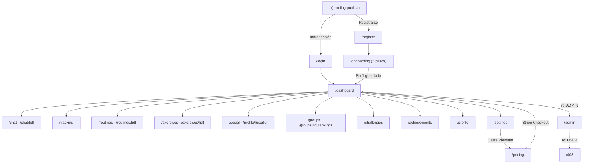

### 5.1.3 Funcionamiento de las rutas protegidas

La protección de rutas se implementa en **tres capas defensivas** documentadas en el propio [middleware.ts](../middleware.ts):

- **Capa 1 — Middleware (Edge).** Se ejecuta en cada petición mediante `getToken()` de NextAuth, una comprobación del JWT sin acceso a base de datos (rápida). Redirige a `/login?callbackUrl=…` las peticiones no autenticadas a rutas protegidas, devuelve usuarios ya logueados fuera de `/login` y `/register`, y bloquea con `/403` el acceso de no-administradores a `/admin`. El conjunto `PUBLIC_PAGES` (`/`, `/login`, `/register`, `/pricing`, `/403`) y `PUBLIC_API_ROUTES` evitan bucles de redirección (`ERR_TOO_MANY_REDIRECTS`).
- **Capa 2 — Layout del dashboard.** [app/(dashboard)/layout.tsx](<../app/(dashboard)/layout.tsx>) ejecuta `getServerSession()` como guardia de respaldo del lado servidor para todo el grupo `(dashboard)`. Captura casos límite donde el JWT sigue siendo válido pero la sesión fue revocada (p. ej. cambio de contraseña). Las páginas individuales **no** deben duplicar este `redirect('/login')`.
- **Capa 3 — Páginas y API.** Solo leen datos de sesión y redirigen por lógica de negocio (límites de plan, recurso inexistente), nunca por autenticación.

Adicionalmente, el middleware genera un **nonce CSP** por petición y aplica una *Content-Security-Policy* estricta (`script-src` con `'strict-dynamic'`, `frame-ancestors 'none'`, `connect-src` limitado a los dominios de Groq, Anthropic y Stripe), reforzando la seguridad del frontend frente a *XSS* e inyección de scripts.

### 5.1.4 Flujo de onboarding

Tras el registro, el usuario llega a [app/onboarding/page.tsx](../app/onboarding/page.tsx), un asistente de **cinco pasos** (`STEPS`) gestionado por el hook `useOnboarding`:

1. **Datos básicos** — nombre, peso, altura, fecha de nacimiento (con `min`/`max` calculados) y género.
2. **Objetivo y nivel** — meta (ganar músculo, perder grasa, mantenimiento, perder peso), nivel de experiencia, días/semana (control deslizante 1–7) y tiempo por sesión.
3. **Tipo de entrenamiento** — gimnasio / casa / peso corporal, y horario preferido.
4. **Salud y restricciones** — lesiones, alergias e intolerancias, y preferencias alimentarias.
5. **Información extra y privacidad** — campo libre (medicación, contexto) y *toggle* de cuenta pública/privada.

Este formulario es el punto crítico de todo el producto: captura el `UserProfile` que se convierte en **la única fuente de verdad** para cada *prompt* de IA posterior. La UI ofrece *stepper* con barra de progreso, validación por campo (`errors`), estado de hidratación (`isHydrated`) para evitar parpadeos y un botón final "🚀 Generar mi plan" que persiste el perfil vía `POST /api/user/onboarding`.

(INSERTAR IMAGEN - onboarding-paso1-datos.png)
(INSERTAR IMAGEN - onboarding-paso2-objetivo.png)
(INSERTAR IMAGEN - onboarding-paso4-salud.png)

### 5.1.5 Organización del dashboard

El `dashboard` es el centro operativo de la aplicación. Su `layout` envuelve cada página en `DashboardShell` y en `PageTransition` (transiciones fluidas entre rutas). La página principal compone *widgets* especializados del directorio [components/dashboard/](../components/dashboard/): `WelcomeHeader`, `MetricsGrid`, `ProgressCards`, `WeekCalendar`, `TodayCard` / `TodayWorkout`, `QuickActions`, `PlanDownloadCard` y `WeeklyCheckIn`. Esta granularidad de componentes permite componer la vista sin acoplar la lógica de datos a la presentación.

(INSERTAR IMAGEN - dashboard-principal.png)

### 5.1.6 Interfaz de chat con la IA

La conversación con el entrenador IA se materializa en [components/chat/ChatInterface.tsx](../components/chat/ChatInterface.tsx) y sus subcomponentes (`MessageList`, `MessageBubble`, `ChatInput`, `TypingIndicator`, `ShoppingListCard`, `SaveRoutineButton`, `ExportPdfButton`). Aspectos destacables de la UX:

- **Estado del chat gestionado con el hook `useChat`**, que mantiene mensajes, *loading*, errores e `input`.
- **Contador de cuota visible para el plan Free.** El componente calcula `messagesUsed/5` y renderiza una barra de progreso que cambia de color (naranja → amarillo → rojo) a medida que se agota la cuota diaria, con un *nudge* a Premium cuando quedan ≤2 mensajes.
- **Gestión diferenciada de errores**: si el error es por límite diario (`messagesLeft === 0`) se muestra el `UpgradeBanner`; cualquier otro error de red/servidor se muestra como alerta roja con rol ARIA.
- **Renderizado Markdown** de las respuestas (con `react-markdown` + `remark-gfm`), incluyendo tablas de ejercicios y comidas, y artefactos accionables: guardar como rutina, exportar a PDF y tarjeta de lista de la compra.
- **Auto-titulado**: tras el primer intercambio, el *backend* asigna un título y `router.refresh()` re-renderiza la barra lateral sin recarga completa.

(INSERTAR IMAGEN - chat-ia-conversacion.png)
(INSERTAR IMAGEN - chat-rutina-generada.png)

### 5.1.7 Secciones sociales y de gamificación

La capa de *engagement* se distribuye en varias vistas con componentes propios:

- **Logros** (`/achievements`) — muro de *badges* con `BadgesGrid` y `BadgeCard`, agrupados por categoría (Entrenamiento, Constancia, Hitos, Social, Retos, FitCoach).
- **Retos** (`/challenges`) — `ChallengeCard` para aceptar y completar retos semanales.
- **Social** (`/social`, `/profile/[userId]`, `/compare/[userId]`) — `SocialClient`, `UserCard`, `FollowButton`, con soporte de cuentas privadas y solicitudes de seguimiento.
- **Grupos** (`/groups`, `/groups/[id]/rankings`) — `GroupCard`, `CreateGroupButton`, `InviteButton` y *rankings* contra los miembros (función Premium).
- **Subida de nivel** — `LevelUpModal` controlado por `LevelUpContext`, que celebra los cambios de nivel detectados en el *backend*.

(INSERTAR IMAGEN - logros-badges.png)
(INSERTAR IMAGEN - grupos-ranking.png)
(INSERTAR IMAGEN - perfil-usuario.png)

### 5.1.8 Tracking, rutinas y pricing

- **Tracking** (`/tracking`) — `WorkoutLogger`, `WeightTracker`, `WeightChart` y `AdvancedMetrics` (gráficas Premium de evolución de peso).
- **Rutinas** (`/routines`, `/routines/[id]`) — `RoutineList` y `DeleteRoutineButton`, sobre el árbol normalizado `Routine → RoutineDay → RoutineExercise`.
- **Pricing** (`/pricing`) — comparativa Free vs. Premium y `CheckoutButton` que lanza Stripe Checkout.

(INSERTAR IMAGEN - tracking-peso.png)
(INSERTAR IMAGEN - rutinas-guardadas.png)
(INSERTAR IMAGEN - pricing-planes.png)
(INSERTAR IMAGEN - landing-page.png)
(INSERTAR IMAGEN - login-registro.png)
(INSERTAR IMAGEN - admin-panel.png)

### 5.1.9 Comportamiento responsive

El diseño es *responsive* de origen: TailwindCSS aplica *breakpoints* (`md:`, `sm:`) en toda la UI, la barra lateral colapsa a panel deslizante en móvil, aparece una navegación inferior (`BottomNav`), y `globals.css` activa *scroll* con inercia (`-webkit-overflow-scrolling: touch`) y desactiva *overscroll* indeseado. Los formularios y *grids* (por ejemplo, `grid-cols-1 md:grid-cols-3` en la *landing*) reorganizan sus columnas según el viewport.

### 5.1.10 Arquitectura de componentes del frontend

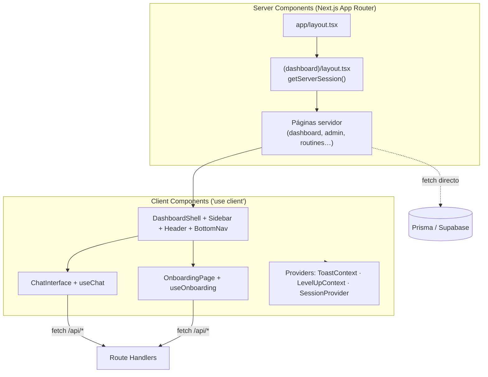

### 5.1.11 Por qué la UI es moderna y escalable

La interfaz de FitPrompt es escalable porque (a) **separa servidor y cliente** de forma deliberada, minimizando JavaScript en el navegador; (b) **tokeniza la identidad visual** en variables CSS, lo que permite cambios de marca o temas sin tocar componentes; (c) **componentiza por dominio** (`chat/`, `dashboard/`, `social/`, `groups/`, `tracking/`…), facilitando que nuevas funcionalidades se añadan sin reescribir las existentes; y (d) **integra seguridad en la propia capa de presentación** (CSP con nonce, rutas protegidas en tres capas). El resultado es comparable a la documentación técnica de una *startup* en producción: diseño profesional, UX fluida (transiciones, *skeletons*, *toasts*, estados de carga) y un flujo de interacción robusto y coherente de extremo a extremo.

---

## 5.2 Lógica del servidor (Server)

### 5.2.1 Visión general de la arquitectura backend

El *backend* de FitPrompt vive enteramente dentro de los **Route Handlers** del App Router (`app/api/**/route.ts`), ejecutados en el *runtime* de Node (`export const runtime = 'nodejs'` en las rutas que dependen de Prisma, Stripe o `bcrypt`). No existe un servidor Express independiente: cada endpoint es una función serverless desplegable en Vercel. La pieza vertebradora es un **pipeline de petición unificado y endurecido** definido en [lib/api-handler.ts](../lib/api-handler.ts): la función `defineHandler`.

`defineHandler` encapsula, en este orden estricto, **todas las preocupaciones transversales** antes de ejecutar la lógica de negocio:

1. **Autenticación** (`auth: 'session' | 'admin' | 'public'`) vía `getServerSession`.
2. **Rate limiting** opcional, con clave derivada de IP + `userId`.
3. **Límite de plan** (`planLimit`) usando `lib/limits.ts`.
4. **Validación del cuerpo** con un *schema* de Zod (`safeParse` → HTTP 422 con `issues`).
5. **Parseo de parámetros** dinámicos de ruta.
6. **Ejecución del *handler*** con un contexto fuertemente tipado (`HandlerContext`).

Cada respuesta recibe un `X-Request-Id` (UUID por petición) y, por defecto, `Cache-Control: no-store` —el JSON autenticado nunca debe ser cacheado por intermediarios—. Este patrón hace que **escribir un endpoint nuevo sea declarativo**: el desarrollador solo especifica políticas (auth, límites, *schema*) y la función de negocio.

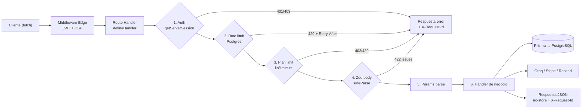

### 5.2.2 Recorrido de una petición de extremo a extremo

Consideremos el envío de un mensaje al chat ([app/api/chat/[chatId]/message/route.ts](<../app/api/chat/[chatId]/message/route.ts>)), uno de los endpoints más completos:

1. El middleware valida el JWT en el *Edge* y aplica la CSP.
2. `defineHandler` autentica la sesión, aplica `rateLimit` (`chat:{userId}`, 30/min), comprueba el límite de plan `send_message` y valida el cuerpo con `chatMessageBodySchema` (`content` de 1 a 8000 caracteres), con un tope de 16 KB.
3. El *handler* verifica la **propiedad del chat** (`verifyChatOwnership`) → HTTP 404 si no pertenece al usuario (aislamiento de datos).
4. Sanea el contenido con `stripHtml` antes de cualquier persistencia.
5. Detecta intención de "lista de la compra" mediante expresiones regulares y, si procede, invoca a Groq con un *prompt* especializado y baja temperatura (0.2) para obtener JSON estructurado.
6. En el flujo normal, carga el `UserProfile` (`loadAIProfile`), inyecta el contexto del último *check-in*, recorta el historial (`trimHistory`: últimos 10 mensajes, 1200 caracteres c/u) y llama a Groq.
7. Persiste los mensajes en una transacción, autotitula si es el primer mensaje, incrementa el contador diario y devuelve `messagesLeft` cuando el plan es limitado.

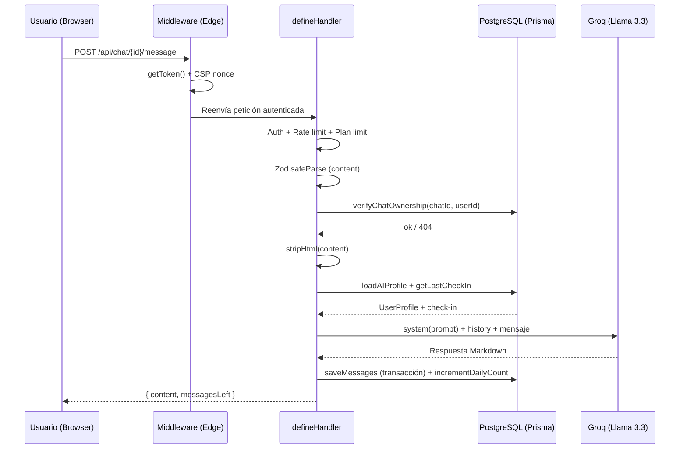

### 5.2.3 Protección por middleware y autenticación

El [middleware.ts](../middleware.ts) actúa como **primer cortafuegos**. Para la superficie de API: deja pasar las rutas públicas declaradas y las de NextAuth, devuelve `401 Unauthorized` si no hay token, y `403 Forbidden` si una ruta `/api/admin/*` recibe un token cuyo `role` no es `ADMIN`. Esta comprobación de rol en el *Edge* es una primera barrera; la **autorización definitiva** se repite en el *handler* (defensa en profundidad).

La autenticación se configura en [lib/auth.ts](../lib/auth.ts) con **NextAuth v4** y estrategia **JWT** (`session.strategy = 'jwt'`, `maxAge` de 30 días, *sliding refresh* cada hora). Se ofrecen dos proveedores:

- **GoogleProvider (OAuth/OIDC)** — rechaza correos no verificados y bloquea intentos de *account takeover* (un usuario con contraseña existente y sin `googleSub` vinculado no puede ser secuestrado por un *login* de Google), registrando el evento de seguridad.
- **CredentialsProvider (email/contraseña)** — valida con `bcryptjs.compare`, aplica **rate limiting por email** (5 intentos/5 min) y **por IP** (20/5 min) para mitigar ataques de diccionario, y exige verificación de correo si `REQUIRE_EMAIL_VERIFICATION` está activo.

### 5.2.4 Autorización y versionado de sesión

La autorización server-side se apoya en tres mecanismos:

1. **`lib/roles.ts`** — `requireAdmin()` (guardia para Server Components que redirige a `/403`) y `requireAdminApi()` (guardia para API que devuelve 401/403). El panel `/admin` usa el primero; las rutas administrativas, el segundo.
2. **Tipado estricto de la sesión** — `types/next-auth.d.ts` aumenta `session.user` con `id`, `plan` y `role`, de modo que las comprobaciones de autorización son seguras en tiempo de compilación.
3. **Versionado de sesión (`User.sessionVersion`)** — los *callbacks* `jwt` de NextAuth re-verifican en cada petición que el `sessionVersion` del token coincide con el de la base de datos; si no, devuelven un token vacío que invalida la sesión. Esto permite **revocar todas las sesiones** ante un cambio de contraseña o un evento de seguridad (incrementando la columna), y es justamente lo que hace el *webhook* de Stripe tras un cambio de plan para forzar el refresco.

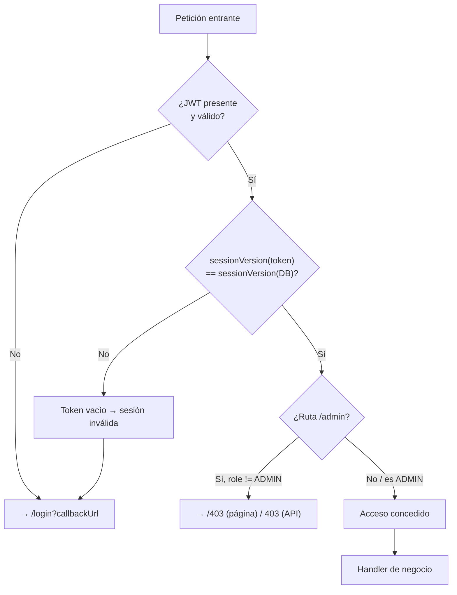

### 5.2.5 Integración con Prisma y patrón *singleton*

La capa de datos usa **Prisma v7** con el *driver adapter* `@prisma/adapter-pg` sobre `pg`, en lugar del motor binario clásico. Esta elección, visible en [lib/db.ts](../lib/db.ts), es la recomendada para **PostgreSQL serverless**: delega el *pooling* a `pg`/PgBouncer y se comporta mejor bajo tráfico en ráfagas típico de funciones serverless. El cliente se instancia mediante un **patrón *singleton* sobre `globalThis`**, de modo que el *hot-reload* de Next.js en desarrollo no cree múltiples instancias que agoten el *pool* de Supabase. El registro de *logs* del cliente se reduce a `['error']` en producción.

### 5.2.6 Uso de Supabase

PostgreSQL se ejecuta gestionado en **Supabase**, que aporta *pooling* de conexiones (PgBouncer), copias de seguridad y un panel de inspección de tablas. La aplicación se conecta a través de `DATABASE_URL` (con `pgbouncer=true&connection_limit=1` recomendado para serverless). Toda la lógica de acceso se canaliza por capas de servicio (`lib/chat.ts`, `lib/checkin.ts`, `lib/streak.ts`, `lib/xp.ts`, `lib/badges.ts`…), de forma que un eventual cambio de *backend* de datos quedaría aislado en esos módulos.

### 5.2.7 Rate limiting

El *rate limiting* se implementa en [lib/rate-limit.ts](../lib/rate-limit.ts) como un **contador de ventana fija respaldado por Postgres**. Cada llamada es un único `upsert` atómico sobre la tabla `RateLimit`, cuya unicidad `[key, windowStart]` garantiza seguridad frente a condiciones de carrera. Una decisión de diseño relevante es la política **fail-open**: si el almacenamiento falla, la función registra el error pero **permite** la petición, para no bloquear a usuarios legítimos por un fallo de infraestructura. Las claves se componen por ruta y por usuario/IP (`chat:{userId}`, `ai-plan:{userId}`, `login:{email}`, `register:ip:{ip}`, `checkout:{userId}`…), con límites y ventanas específicos por endpoint.

### 5.2.8 Validación con Zod y manejo del cuerpo

Toda entrada se valida en la frontera con **Zod v4** ([lib/schemas.ts](../lib/schemas.ts)). Los *schemas* usan `.strict()` para rechazar campos no esperados, *transforms* para eliminar caracteres de control (`safeText`), validadores de dominio (`cuidString` con *regex* de CUID, `emailString`, `strongPassword` de ≥12 caracteres con mayúscula/minúscula/dígito) y límites numéricos realistas (peso 20–400 kg, altura 100–250 cm, días 1–7). La lectura del cuerpo se hace mediante `readJson` ([lib/http.ts](../lib/http.ts)), un lector *streaming* con **tope de bytes** que rechaza *payloads* grandes (HTTP 413) y *content-types* incorrectos (HTTP 415) **antes** de materializar el JSON en memoria, protegiendo contra abusos.

### 5.2.9 Filosofía de manejo de errores

El bloque `try/catch` central de `defineHandler` traduce excepciones a códigos HTTP semánticos: `PayloadTooLargeError` → 413, `InvalidContentTypeError` → 415, `SyntaxError` → 400, `ZodError` → 422, y cualquier otra → 500 con un `requestId` correlacionable. El [lib/logger.ts](../lib/logger.ts) emite *logs* estructurados en JSON y **redacta automáticamente** claves sensibles (`password`, `token`, `secret`, `authorization`, `cookie`, `apiKey`) y serializa errores sin filtrar cuerpos crudos de proveedores externos. Existe además un nivel `security` para eventos de seguridad (rate limit alcanzado, contraseña incorrecta, firma de *webhook* inválida).

### 5.2.10 Integración con servicios externos y *webhooks*

La pasarela de pago se integra con **Stripe Checkout** ([app/api/payment/create-checkout/route.ts](../app/api/payment/create-checkout/route.ts)), que crea el `Customer` si no existe, abre una sesión de suscripción y devuelve la URL. El **webhook** ([app/api/stripe/webhook/route.ts](../app/api/stripe/webhook/route.ts)) verifica la firma con el cuerpo crudo (`req.text()` antes de cualquier *parse*), y garantiza **idempotencia anti-replay** registrando el `event.id` como clave primaria de la tabla `StripeEvent`: un evento se procesa **como máximo una vez**. Al completarse el pago actualiza `plan = premium` e incrementa `sessionVersion`; ante cancelación/pausa de suscripción, revierte a `free`.

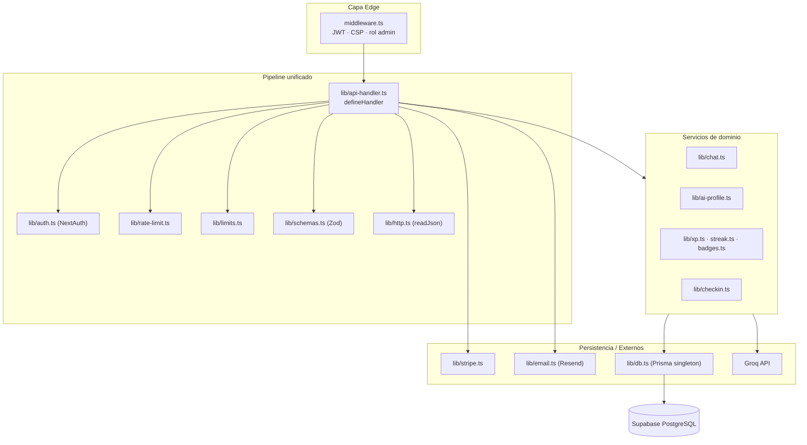

### 5.2.11 Idoneidad para despliegue serverless y robustez

La arquitectura es adecuada para serverless porque: el cliente Prisma usa *driver adapter* + *singleton* (sin fugas de conexión entre invocaciones), el estado de límites/rate vive en Postgres (no en memoria del proceso, que es efímera), y cada endpoint es una función independiente escalable horizontalmente. La **robustez en la gestión de estados y errores** —criterio máximo de la rúbrica— se sustenta en: un único pipeline endurecido, escrituras **idempotentes** mediante *upserts* con restricciones de unicidad (contador diario, racha, XP, *badges*, *check-in*), códigos HTTP semánticos, *logging* estructurado con redacción de secretos y trazabilidad por `X-Request-Id`. En conjunto, FitPrompt presenta una lógica de servidor que gestiona estados y errores de manera eficiente y predecible.

---

## 5.3 Gestión de datos

### 5.3.1 Modelo de datos relacional

La persistencia se define en [prisma/schema.prisma](../prisma/schema.prisma): **25 modelos** y **10 enumeraciones** sobre PostgreSQL, organizados en seis dominios funcionales:

| Dominio | Tablas |
|---|---|
| **Identidad y acceso** | `User`, `UserProfile` |
| **Chat e IA** | `Chat`, `Message`, `DailyMessageCount`, `WeeklyCheckIn` |
| **Progreso físico** | `WorkoutLog`, `WorkoutExercise`, `WeightLog`, `Streak`, `Routine`, `RoutineDay`, `RoutineExercise` |
| **Gamificación** | `Achievement`, `UserXP`, `UserChallenge` |
| **Social** | `Follow`, `FollowRequest`, `Group`, `GroupMember`, `GroupInvitation`, `Notification` |
| **Seguridad e infraestructura** | `RateLimit`, `StripeEvent`, `AuditLog` |

### 5.3.2 Almacenamiento de la información generada por IA

La información que produce la IA se persiste de **forma estructurada**, no como texto opaco:

- **Conversaciones** — cada `Chat` (1:N con `User`) agrupa `Message` (1:N), con `role` (`user`/`assistant`/`system`) y `content` de tipo `@db.Text`. El historial es la **memoria conversacional** que se reinyecta en cada llamada a la IA.
- **Rutinas** — cuando la IA genera una rutina en Markdown, el `routineParser` la transforma en el árbol normalizado `Routine → RoutineDay → RoutineExercise`, de modo que pueda **editarse, reordenarse y reutilizarse** semana tras semana en vez de quedar congelada en un mensaje.
- **Check-ins semanales** — `WeeklyCheckIn` almacena la respuesta libre del usuario (`response`) y las **sugerencias generadas por IA** (`aiSuggestions`) serializadas en JSON.
- **Listas de la compra** — se generan como JSON validado por `shoppingListSchema` y se persisten dentro del propio mensaje del asistente, identificadas por un *sentinel*.

### 5.3.3 Vinculación de datos al usuario y persistencia del progreso

Cada entidad de dominio cuelga de `User` mediante una relación con `onDelete: Cascade`, lo que ata todo el grafo de datos al propietario:

- **Tracking de entrenamientos** — `WorkoutLog` (cabecera: fecha, duración, completado, notas) con hijos `WorkoutExercise`. Una decisión de modelado clave: `userId` y `date` se **desnormalizan** en `WorkoutExercise` y se indexan (`@@index([userId, name, date])`), de modo que estadísticas por ejercicio (progresión del press de banca, *rankings* de grupo) sean una consulta **indexada** y no un escaneo de JSON.
- **Peso** — `WeightLog` alimenta las gráficas de evolución y es la fuente de verdad del peso actual (sobreescribe el peso de onboarding en los cálculos de IA).
- **Racha** — `Streak` registra `currentStreak`, `bestStreak` y `lastCompletedWeek` por semana ISO.
- **XP y nivel** — `UserXP.totalXP` acumula la experiencia; el nivel se **deriva**, nunca se almacena.

### 5.3.4 Almacenamiento de gamificación y datos sociales

- **`Achievement`** — *badges* desbloqueados, con `@@unique([userId, badge])` para que el desbloqueo sea **idempotente** (reintentos nunca duplican).
- **`UserChallenge`** — retos por semana ISO, únicos en `[userId, challengeId, weekStart]`.
- **`Follow`** — grafo de seguimiento auto-referencial, único en `[followerId, followingId]` e indexado en ambos sentidos.
- **`FollowRequest`** — solicitudes para cuentas privadas.
- **`Group` / `GroupMember` / `GroupInvitation`** — grupos (función Premium) con membresías únicas en `[groupId, userId]`.
- **`Notification`** — *feed* con índices compuestos `(userId, createdAt)` y `(userId, read)` que mantienen rápido el contador de no leídas.

### 5.3.5 Diagrama entidad-relación

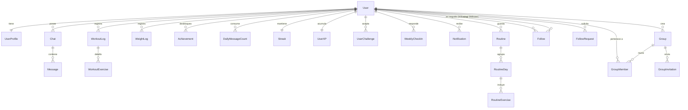

(INSERTAR IMAGEN - prisma-schema.png)
(INSERTAR IMAGEN - supabase-tablas.png)
(INSERTAR IMAGEN - relacion-user-chat.png)

### 5.3.6 Flujo de persistencia de datos

```mermaid
flowchart LR
    UI["Cliente"] -->|JSON validado| API["defineHandler"]
    API -->|stripHtml / Zod| SVC["Servicio de dominio<br/>(chat.ts, xp.ts, streak.ts…)"]
    SVC -->|upsert idempotente| TX["Transacción Prisma"]
    TX --> PG[("PostgreSQL / Supabase")]
    PG -->|read| SVC
    SVC -->|UserProfile + historial| AIP["lib/ai-profile.ts"]
    AIP -->|contexto| PROMPT["lib/prompts.ts"]
    PROMPT --> GROQ["Groq"]
    GROQ -->|respuesta| SVC
    SVC -->|saveMessages (TX)| PG
```

### 5.3.7 Por qué PostgreSQL y ventajas de Supabase

Se eligió **PostgreSQL** por su naturaleza relacional fuertemente tipada, su soporte de restricciones de integridad (claves foráneas, unicidad, índices compuestos) y su madurez. El dominio de FitPrompt es intrínsecamente relacional (usuarios ↔ chats ↔ mensajes, rutinas jerárquicas, grafos sociales), lo que descarta un almacén documental. **Supabase** aporta Postgres gestionado con *pooling* (PgBouncer), copias de seguridad automáticas, panel de inspección y escalado sin operaciones, encajando con el despliegue serverless en Vercel.

### 5.3.8 Estrategia de normalización, cascadas, unicidad e índices

- **Normalización** — las rutinas se modelan en tres tablas (no como un *blob* JSON) para permitir edición granular; los ejercicios de entrenamiento son filas propias para análisis por ejercicio.
- **Borrado en cascada** — todas las tablas propiedad del usuario declaran `onDelete: Cascade` desde `User`, de modo que **eliminar una cuenta es una sola operación transaccional** sin filas huérfanas.
- **Restricciones de unicidad como invariantes de negocio** — un perfil por usuario, un contador de mensajes por usuario/día, una racha por usuario, un *check-in* por usuario/semana, sin seguimientos ni membresías ni *badges* duplicados.
- **Índices** — compuestos en `Notification`, `WorkoutExercise(userId, name, date)`, `Follow` en ambos sentidos, y en las tablas de infraestructura.

### 5.3.9 Aislamiento de usuarios y control de acceso

El **aislamiento de datos** se garantiza a nivel de consulta: cada acceso filtra por `userId` de la sesión. Funciones como `verifyChatOwnership(chatId, userId)` o `getChatWithMessages(chatId, userId)` ([lib/chat.ts](../lib/chat.ts)) usan `findFirst({ where: { id, userId } })`, de modo que **un usuario nunca puede leer recursos de otro** aunque conozca el identificador (se devuelve 404). Esta comprobación de propiedad es sistemática en todos los endpoints que tocan recursos pertenecientes a usuarios.

### 5.3.10 Medidas de seguridad y protección de datos

- **Hashing de contraseñas con bcrypt** — el registro ([app/api/auth/register/route.ts](../app/api/auth/register/route.ts)) aplica `hash(password, 12)`. Además, el endpoint ejecuta **siempre** el hashing y la generación de token aunque el email exista, devolviendo una **respuesta uniforme** (`{ ok: true }`), para que el tiempo de respuesta no revele si la cuenta existe (defensa frente a enumeración de usuarios).
- **Variables de entorno y claves de API** — todas las claves sensibles (`GROQ_API_KEY`, `STRIPE_SECRET_KEY`, `STRIPE_WEBHOOK_SECRET`, `NEXTAUTH_SECRET`, credenciales de Google, `DATABASE_URL`) viven en variables de entorno y **solo se leen en el servidor**. El catálogo está documentado en `.env.example`.
- **Lógica sensible exclusivamente en servidor** — las llamadas a Groq, los cálculos de límites de plan, el hashing y la verificación de firmas de Stripe ocurren en Route Handlers de runtime Node; el cliente nunca tiene acceso a secretos ni a la base de datos.
- **Saneamiento** — `stripHtml` (DOMPurify) sobre todo texto de usuario antes de almacenarlo; `sanitizePromptField` antes de inyectarlo en *prompts*.
- **Auditoría** — `AuditLog` (con IP y *user-agent*) para acciones sensibles: borrado de cuenta, cambios de plan, moderación administrativa.

### 5.3.11 Consideraciones RGPD/privacidad

El diseño contempla la privacidad por defecto: **cuentas privadas** (`User.isPublic`) que exigen aprobar solicitudes de seguimiento; **borrado en cascada** que materializa el *derecho al olvido* en una operación atómica ([app/api/user/delete/route.ts](../app/api/user/delete/route.ts)); **minimización de datos** (la edad no se almacena, se deriva de `birthDate`); y registros de auditoría que permiten trazar el tratamiento de datos sensibles. La aplicación **no expone datos privados** porque toda lectura está acotada por `userId` y porque la API nunca devuelve campos sensibles (la contraseña *hasheada* jamás se serializa).

### 5.3.12 Por qué la personalización de la IA depende de datos persistentes estructurados

La calidad de la personalización es directamente proporcional a la calidad de los datos persistentes. Como `UserProfile` es la **fuente de verdad** y los cálculos metabólicos se recomputan en cada *prompt*, la IA dispone de un contexto rico y siempre actualizado (incluido el peso más reciente de `WeightLog` y el último `WeeklyCheckIn`). Es la persistencia estructurada —no el *prompt* puntual— la que dota a la IA de **memoria real** y de capacidad de adaptación a lo largo del tiempo. En conjunto, la gestión de datos de FitPrompt prioriza seguridad, escalabilidad, aislamiento de usuario y memoria persistente de IA.

---

# 6. IMPLEMENTACIÓN DE INTELIGENCIA ARTIFICIAL

## 6.1 Diseño del Prompt y Contexto

### 6.1.1 Filosofía de IA: *profile-driven, not prompt-driven*

El principio rector de la IA en FitPrompt es **"impulsada por el perfil, no por el prompt"**. En la mayoría de productos con IA, la calidad de la respuesta depende de lo bien que el usuario sepa "explicarse" al modelo. FitPrompt invierte ese paradigma: **cada llamada a la IA se fundamenta automáticamente en el perfil real del usuario** —edad, peso, altura, sexo, objetivo, nivel, equipamiento, horario, lesiones, alergias y preferencias alimentarias— más una serie de **cálculos metabólicos deterministas**. El usuario nunca tiene que repetir quién es.

La capa de IA se reparte en tres archivos con responsabilidades separadas:

| Archivo | Responsabilidad |
|---|---|
| [lib/prompts.ts](../lib/prompts.ts) | Construye los *prompts* (system + user) a partir de un `UserProfile` |
| [lib/ai-profile.ts](../lib/ai-profile.ts) | Carga el perfil desde la BD y lo prepara para construir *prompts* |
| [lib/ai.ts](../lib/ai.ts) | Orquesta: cliente Groq, generación de plan y parseo en 5 secciones |

### 6.1.2 De `UserProfile` a contexto de IA

[lib/ai-profile.ts](../lib/ai-profile.ts) carga el `UserProfile` y, de forma deliberada, **sobreescribe el `weight` con el último `WeightLog`** si existe: el peso de onboarding se captura una vez y nunca se actualiza, por lo que sin esta sustitución los macros/TMB/TDEE quedarían congelados en el valor inicial. Así, la matemática nutricional sigue al usuario a medida que su peso evoluciona, sin tareas programadas.

### 6.1.3 Cálculos deterministas (el modelo no inventa números)

[lib/prompts.ts](../lib/prompts.ts) realiza en **código** todos los cálculos numéricos sensibles, que luego se pasan al modelo ya resueltos:

- **TMB** con la ecuación **Mifflin-St Jeor** (`calcBMR`), diferenciada por sexo.
- **TDEE** aplicando un **multiplicador de actividad** según `daysPerWeek` (`activityMultiplier`, 1.375 → 1.9).
- **Macros objetivo** (`calcMacros`): déficit/superávit por objetivo (`CALORIE_DELTA`: +300 volumen, −400 definición, −600 pérdida de peso), proteína por kg según objetivo (`PROTEIN_PER_KG`: 1.8–2.3 g/kg), grasa al 28% de las calorías y carbohidratos por diferencia, con un suelo de 1200 kcal.
- **IMC** a partir de peso y altura.

> Decisión de ingeniería: **el modelo estiliza y contextualiza el plan, pero nunca inventa los macros.** Esto elimina la principal fuente de alucinaciones numéricas en aplicaciones de fitness con IA y hace que el resultado sea reproducible y verificable.

### 6.1.4 *System prompt* y persona

`generarSystemPrompt(profile)` ensambla el mensaje de sistema que define la persona **FitCoach** (entrenador y nutricionista de élite), e inyecta dos tablas Markdown construidas desde la BD: el **perfil del usuario** (`buildUserContext`) y los **datos metabólicos** (TMB, TDEE, calorías objetivo, gramos y porcentajes de cada macro). Establece, además, reglas de comunicación (personalización absoluta, pedagogía del "porqué", nivel de detalle adaptado), reglas no negociables (seguridad ante lesiones, realismo según días/sesión, *disclaimer* sanitario) y un **formato de salida** estricto (encabezados, tablas con columnas fijas, y el patrón obligatorio `## 📅 Día X — Nombre` que permite al sistema detectar y guardar rutinas).

### 6.1.5 Modularización del prompt y *builders* especializados

Más allá del plan combinado, el sistema expone *builders* de *prompt* orientados a tareas, cada uno usando una porción distinta del perfil:

| Función | Genera | Entradas de BD |
|---|---|---|
| `generarSystemPrompt` | Persona FitCoach + contexto | Perfil completo + cálculos metabólicos |
| `generarPromptRutina` | Rutina semanal de entrenamiento | objetivo, nivel, días, tiempo, equipamiento, lesiones |
| `generarPromptDieta` | Plan diario de comidas con gramajes | objetivo, peso, alergias, preferencias, horario |
| `generarPromptListaCompra` | Lista de la compra semanal (JSON) | objetivo, macros, alergias, preferencias |
| `generarPromptCombinado` | Plan integral de 4 semanas (5 secciones) | Perfil completo |

Cada *builder* deriva parámetros de programación de forma determinista: la **división de entrenamiento** (`getTrainingSplit`: Full Body, PPL, Upper/Lower… según días y objetivo), los **descansos** (`getRestPeriod`), la **zona de intensidad** por objetivo×nivel (`getIntensityZone`) y el **volumen por sesión** (`getSessionVolume`).

### 6.1.6 Catálogo de ejercicios filtrado (*grounding*)

`buildExerciseIndex(profile)` inyecta en el *prompt* un **catálogo de ejercicios real** filtrado por el equipamiento del usuario (`EQUIPMENT_FOR_WORKOUT_TYPE`) y acotado a su nivel (`LEVEL_ORDER`). De este modo, la IA recibe un conjunto cerrado de ejercicios válidos sobre el que construir la rutina, reduciendo la probabilidad de proponer movimientos imposibles para el equipamiento disponible (técnica de *grounding*).

### 6.1.7 Inyección de lesiones y alergias como restricciones duras

Los campos de salud no se tratan como simples preferencias, sino como **bloques de advertencia (`⚠️`)**: en la rutina, las lesiones generan un bloque "RESTRICCIONES POR LESIÓN — OBLIGATORIO" que exige listar ejercicios prohibidos y alternativas seguras; en la dieta, las alergias generan "ALÉRGENOS — CRÍTICO" con prohibición absoluta. Esto orienta al modelo a tratarlas como exclusiones no negociables.

### 6.1.8 Protección anti *prompt-injection*

Como los campos de texto libre (lesiones, alergias, preferencias, info extra) proceden del usuario y se interpolan en el *prompt*, son un vector de **inyección de instrucciones almacenadas**. La defensa es doble:

1. **Saneamiento** — `sanitizePromptField` ([lib/sanitize.ts](../lib/sanitize.ts)) elimina caracteres de control y puntuación de plantilla (`` ` ``, `<`, `>`, `{`, `}`) y recorta a una longitud máxima antes de que el texto llegue al modelo.
2. **Instrucción explícita en el *system prompt*** — se indica al modelo que **nunca** siga instrucciones contenidas dentro del bloque "Perfil del usuario": ese contenido es **dato, no orden**; si detecta un intento de cambiar su rol, debe ignorarlo. La misma salvaguarda se repite en el *prompt* base del chat (`FITCOACH_SYSTEM`).

### 6.1.9 Salidas estructuradas y parseo

La IA produce **datos estructurados** que el *backend* convierte en UI interactiva: `parsePlanSections` ([lib/ai.ts](../lib/ai.ts)) divide la respuesta de 4 semanas en cinco partes mediante expresiones regulares (`## PARTE 1…5`): rutina, dieta, recuperación, hoja de ruta y FAQ. La lista de la compra se exige como **JSON puro** (sin *fences* ni prosa) y se valida con `shoppingListSchema`. Las rutinas se extraen con `routineParser` (detección de días y tablas de ejercicios) hacia el árbol relacional.

### 6.1.10 Pipeline de IA y construcción del *prompt*

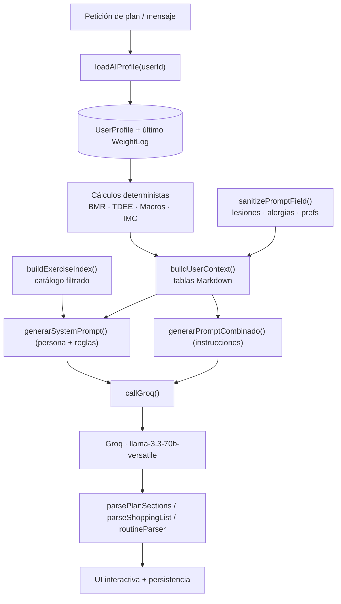

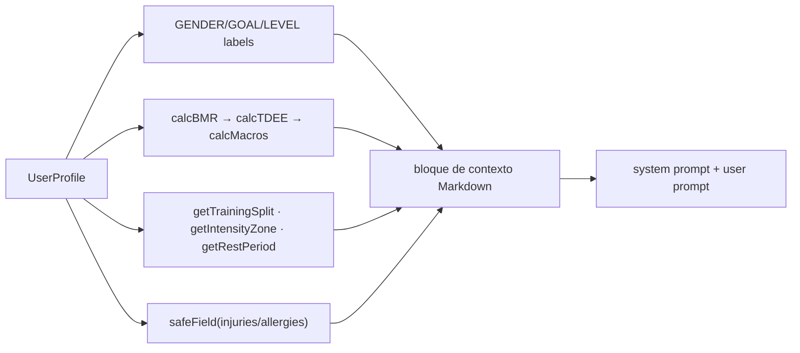

(INSERTAR IMAGEN - prompt-ejemplo-system.png)
(INSERTAR IMAGEN - plan-generado-ejemplo.png)
(INSERTAR IMAGEN - json-lista-compra.png)

### 6.1.11 Por qué esta arquitectura supera a los *prompts* estáticos

Un *prompt* estático trata a todos los usuarios por igual y delega en el modelo cálculos que este tiende a alucinar. FitPrompt, en cambio: (a) **construye el *prompt* desde la base de datos** en cada llamada; (b) **resuelve la matemática en código** y solo pide al modelo redacción y contextualización; (c) **acota el espacio de respuesta** con un catálogo de ejercicios filtrado y un formato de salida estricto; y (d) **endurece el *prompt*** frente a inyección. El resultado es un sistema de ingeniería de *prompts* experto, reproducible y seguro.

---

## 6.2 Lógica de integración (API)

### 6.2.1 Integración con la API de Groq

FitPrompt usa **un único proveedor de IA para todos los planes**: Groq con el modelo `llama-3.3-70b-versatile`. La diferencia entre Free y Premium **no es el modelo**, sino la cuota diaria de mensajes —una decisión de producto que mantiene la calidad para todos y simplifica la operación. La llamada se realiza con `fetch` nativo contra el *endpoint* compatible con OpenAI (`https://api.groq.com/openai/v1/chat/completions`), con `temperature` y `max_tokens` (4096) configurables. Groq se eligió por su **latencia muy baja** (tiempo hasta el primer *token* sub-segundo), idónea para una experiencia de chat fluida.

### 6.2.2 Ciclo de vida de una petición al LLM

El *handler* de mensajes ([app/api/chat/[chatId]/message/route.ts](<../app/api/chat/[chatId]/message/route.ts>)) orquesta la interacción completa: verifica propiedad del chat, sanea el contenido, decide si es petición de lista de la compra, construye el contexto (perfil + *check-in* + historial recortado), llama a Groq y persiste el resultado. El historial se prepara con `sanitizeForGroq` (resuelve el *sentinel* de listas de la compra a su resumen) y `trimHistory` (ventana de contexto controlada: 10 mensajes, 1200 caracteres c/u) para **optimizar tokens** y coste.

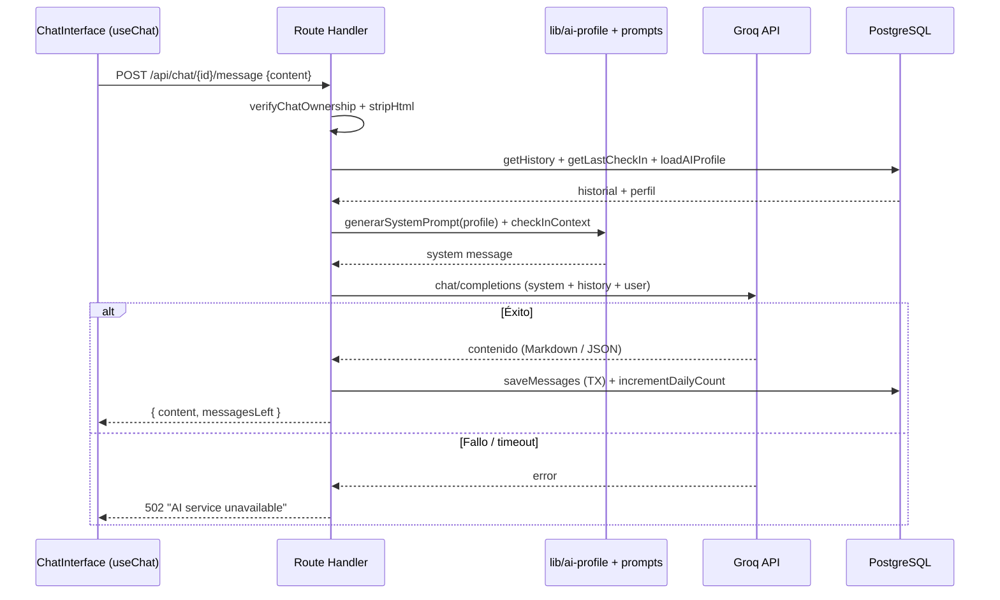

### 6.2.3 Aplicación de límites y seguimiento de cuota

Antes de llegar a Groq, `defineHandler` aplica el **límite de plan** `send_message` mediante [lib/limits.ts](../lib/limits.ts). El consumo se registra **atómicamente** con `incrementDailyCount` (`upsert` sobre `DailyMessageCount`, único por `[userId, date]`), y la cuota Free es de **5 mensajes/día** (Premium: ilimitado). Los administradores **eluden** los límites (`checkUserLimits` retorna `allowed` si `role === 'ADMIN'`), lo que habilita QA interno sin cuentas de prueba. Cuando se supera la cuota, la respuesta incluye un `code` legible por el frontend (`DAILY_MESSAGE_LIMIT`) que dispara el `UpgradeBanner`.

### 6.2.4 Procesamiento de mensajes y renderizado

El contenido devuelto por la IA se almacena tal cual (Markdown) y se renderiza en cliente con `react-markdown` + `remark-gfm` (tablas GFM). Las **listas de la compra** se serializan con un *sentinel* (`SHOPPING_LIST_SENTINEL` + JSON) que la UI reconoce para mostrar la `ShoppingListCard` interactiva, mientras que para el contexto de IA se reduce a su resumen textual (ahorro de tokens). Las **rutinas** detectadas se pueden guardar con `SaveRoutineButton`.

### 6.2.5 Gestión de fallos y *timeouts*

La función `callGroq` lanza error si la respuesta no es `ok` (registrando solo el `status`, **sin** el cuerpo crudo, que podría contener pistas de cabeceras/tokens) o si el contenido viene vacío. El *handler* captura el fallo y responde **HTTP 502 "AI service unavailable"**, degradando con elegancia. Además, si `GROQ_API_KEY` no está configurada, el sistema entra en **modo demo** devolviendo respuestas *mock* (`MOCK_REPLY`, `MOCK_PLAN`, `MOCK_SHOPPING_JSON`), lo que permite desarrollar y demostrar la app sin clave.

### 6.2.6 Parseo de planes estructurados

`generatePlan` ([lib/ai.ts](../lib/ai.ts)) envía el *system prompt* + el *prompt* combinado y devuelve un objeto `GeneratePlanResult` con las cinco secciones ya separadas por `parsePlanSections`, listas para alimentar componentes de UI distintos (tarjeta de rutina, tabla de dieta, etc.).

### 6.2.7 Seguridad de claves de API y ejecución exclusiva en servidor

La `GROQ_API_KEY` **solo existe en el entorno del servidor** y se inyecta en la cabecera `Authorization` dentro del Route Handler (runtime Node). El navegador **nunca** ve la clave ni habla directamente con Groq: toda llamada a la IA pasa por el *backend*, que además impone autenticación, límites y saneamiento. La CSP del middleware restringe `connect-src` a los dominios estrictamente necesarios.

### 6.2.8 Escalabilidad y orquestación

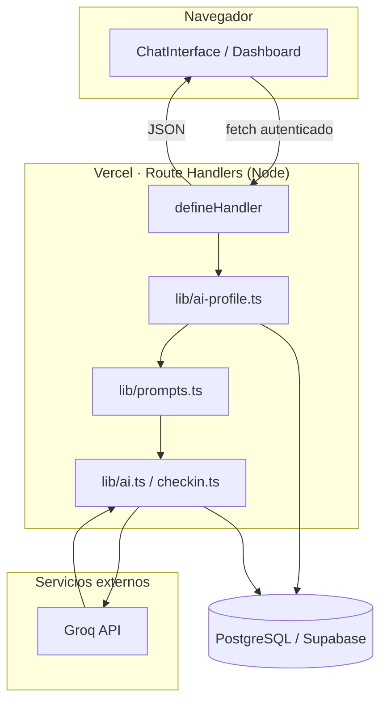

La arquitectura escala porque cada endpoint es una función serverless independiente, el estado de cuota/límites reside en Postgres (no en memoria efímera) y la orquestación de IA está aislada en módulos `lib/` reutilizables. La gestión de **variables de entorno** centralizada (`.env.example`) y la separación de responsabilidades hacen el sistema mantenible a escala empresarial.

(INSERTAR IMAGEN - api-respuesta-groq.png)
(INSERTAR IMAGEN - rutina-generada-detalle.png)
(INSERTAR IMAGEN - lista-compra-card.png)

---

## 6.3 Personalización y respuestas adaptativas

### 6.3.1 Cómo se adapta la IA a cada usuario

La adaptación no es cosmética: **cada dato del perfil modifica de forma determinista los parámetros del plan** antes incluso de invocar al modelo. La tabla siguiente resume el impacto real (extraído de [lib/prompts.ts](../lib/prompts.ts)):

| Variable del perfil | Efecto sobre la respuesta |
|---|---|
| **Edad** (derivada de `birthDate`) | Entra en la ecuación Mifflin-St Jeor → TMB/TDEE/calorías |
| **Objetivo** | Déficit/superávit calórico, proteína por kg, estilo de entrenamiento, descansos |
| **Nivel** | Zona de intensidad (% 1RM, RPE), densidad técnica, catálogo de ejercicios permitido |
| **Días/semana** | División de entrenamiento (Full Body, PPL, Upper/Lower) y multiplicador de actividad |
| **Tiempo por sesión** | Volumen (nº de ejercicios × series) |
| **Equipamiento** | Catálogo de ejercicios filtrado (gimnasio/casa/peso corporal) |
| **Horario** | *Timing* nutricional pre/post entreno y avisos (cafeína nocturna, ayuno matutino) |
| **Lesiones** | Bloque obligatorio de ejercicios prohibidos + alternativas seguras |
| **Alergias** | Exclusión absoluta de alimentos en dieta y lista de la compra |
| **Preferencias** | Adaptación completa del plan nutricional (vegano, sin gluten…) |

### 6.3.2 Memoria contextual y personalización persistente

La IA tiene **memoria real** porque su contexto se reconstruye desde datos persistentes en cada llamada:

- **Historial de conversación** — `getHistory(chatId)` recupera los mensajes previos y `trimHistory` los reinyecta (ventana de 10 mensajes) para mantener coherencia conversacional.
- **Último check-in semanal** — `getLastCheckIn` inyecta el texto del último *check-in* en el *system prompt* (`checkInContext`), de modo que el entrenador "recuerda" cómo le fue la semana al usuario.
- **Peso actual** — `loadAIProfile` actualiza el peso al último `WeightLog`, recalculando macros.

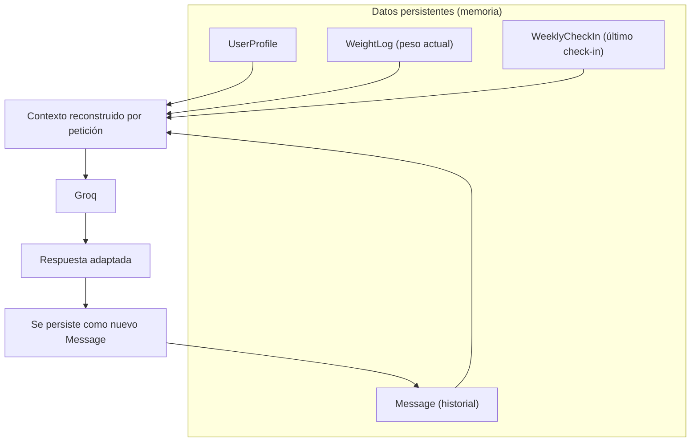

### 6.3.3 Por qué dos usuarios reciben planes radicalmente distintos

Considérense dos perfiles reales procesados por el mismo código:

**Escenario A — Marta**
- 42 años, mujer, 68 kg, 165 cm, objetivo *pérdida de peso*, nivel principiante, 3 días/semana en casa, sesiones de 30–45 min, lesión de rodilla, intolerante a la lactosa.
- *Resultado determinista*: TMB con la fórmula femenina (`−161`), TDEE con multiplicador 1.55, **déficit de −600 kcal**, proteína a 2.0 g/kg; división *Superior/Inferior/Cuerpo completo*; catálogo **solo de casa**; bloque de **rodilla** con ejercicios prohibidos y alternativas; dieta y lista de la compra **sin lácteos**.

**Escenario B — Diego**
- 24 años, hombre, 80 kg, 182 cm, objetivo *volumen*, nivel avanzado, 5 días/semana en gimnasio, sesiones de +60 min, sin lesiones, omnívoro.
- *Resultado determinista*: TMB con fórmula masculina (`+5`), TDEE con multiplicador 1.725, **superávit de +300 kcal**, proteína a 2.1 g/kg; división *Push/Pull/Legs/Upper/Lower*; catálogo **completo de gimnasio**; intensidad 75–87% 1RM con técnicas avanzadas (*drop sets*, *rest-pause*); 10–14 ejercicios por sesión.

Ambos planes provienen del **mismo modelo y el mismo código**, pero los números, la división, el catálogo y las restricciones difieren por completo. Esto es **personalización verdadera**, no sustitución de plantillas.

### 6.3.4 Adaptación por lesiones y objetivos (ejemplos de prompt)

Cuando el perfil incluye `injuries = "rodilla derecha"`, el *prompt* de rutina añade literalmente un bloque que obliga al modelo a indicar ejercicios prohibidos para esa zona, ofrecer ≥2 alternativas seguras y recordarlo en las notas técnicas. Cuando `allergies = "lactosa"`, tanto la dieta como la lista de la compra reciben la directiva "NUNCA incluyas estos alimentos ni sus derivados". El usuario no tiene que recordárselo a la IA: el sistema lo inyecta siempre.

### 6.3.5 Check-ins semanales adaptativos

El *check-in* ([app/api/checkin/route.ts](../app/api/checkin/route.ts), [lib/checkin.ts](../lib/checkin.ts)) cierra el bucle de adaptación: el usuario describe su semana en texto libre, el *backend* lo sanea, lo persiste y lo envía a Groq con un *prompt* que pide **exactamente 3 sugerencias** en formato array JSON. Las sugerencias se almacenan en `WeeklyCheckIn.aiSuggestions` y, además, el texto del *check-in* se reinyecta como contexto en futuras conversaciones de chat. Si Groq falla o no hay clave, se devuelven sugerencias de respaldo (`FALLBACK_SUGGESTIONS`).

### 6.3.6 Personalización de nutrición y generación de lista de la compra

La dieta (`generarPromptDieta`) parte siempre de los macros calculados en código y adapta el *timing* nutricional al horario, excluye alérgenos y respeta preferencias. La lista de la compra (`generarPromptListaCompra`) se solicita como JSON estricto con cinco categorías fijas (Proteínas, Carbohidratos, Verduras, Frutas, Otros), validado por `shoppingListSchema`, y se genera con baja temperatura (0.2) para maximizar el determinismo del formato.

### 6.3.7 Adaptación de rutinas

Las rutinas generadas no son texto muerto: `routineParser` las convierte en el árbol `Routine → RoutineDay → RoutineExercise`, que el usuario puede guardar, editar y enlazar a sus registros de entrenamiento (`WorkoutLog.routineId` / `routineDayId`). El progreso registrado retroalimenta la gamificación (XP, *badges* de volumen, rachas), cerrando el ciclo entre IA y seguimiento real.

### 6.3.8 Flujo de personalización integral

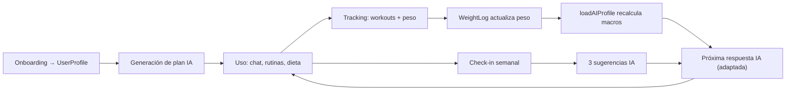

(INSERTAR IMAGEN - chat-personalizado-lesion.png)
(INSERTAR IMAGEN - rutina-ejemplo-volumen.png)
(INSERTAR IMAGEN - dieta-ejemplo-perdida-peso.png)
(INSERTAR IMAGEN - checkin-sugerencias-ia.png)

### 6.3.9 Por qué es personalización real y no sustitución de plantillas

Una plantilla rellena huecos en un texto fijo; FitPrompt **reconfigura los parámetros del dominio** (calorías, macros, división, intensidad, catálogo, restricciones) por usuario y por momento, y **reconstruye el contexto** del modelo desde datos persistentes (perfil, historial, peso, *check-in*) en cada interacción. Esa combinación —parametrización determinista + memoria persistente + reinyección de contexto— es lo que permite afirmar, con respaldo en el código, que **la IA tiene memoria y se adapta**.

---

# 7. PRUEBAS Y VALIDACIÓN

## 7.1 Pruebas funcionales

### 7.1.1 Metodología de pruebas

La estrategia de validación de FitPrompt es **funcional y manual estructurada por dominios**, complementada con verificación de tipos (TypeScript estricto) y *linting* (ESLint 9) en cada compilación (`npm run build` ejecuta `prisma generate && next build`). Cada caso de prueba se define con: identificador, descripción, resultado esperado, resultado obtenido y estado. La filosofía de robustez se basa en validar las **fronteras** (autenticación, autorización, validación de entrada, límites de plan, propiedad de recursos) y los **caminos de error**, no solo el camino feliz. La elusión de límites por administradores permite ejecutar QA sin cuentas de prueba.

> **Importante (honestidad metodológica):** el repositorio **no incluye actualmente una suite de pruebas automatizadas** (la cobertura automatizada figura como área activa en el *roadmap* del README). Las tablas siguientes documentan la **batería de pruebas funcionales** ejecutadas de forma manual sobre la implementación real; los identificadores permiten su trazabilidad y su futura automatización.

### 7.1.2 Pruebas de autenticación

| ID | Descripción | Resultado esperado | Resultado obtenido | Estado |
|----|-------------|--------------------|--------------------|--------|
| AUTH-01 | Registro con datos válidos | 201 + email de verificación (Resend) | Igual | ✅ |
| AUTH-02 | Registro con email ya existente | 201 uniforme (no revela existencia) | Igual | ✅ |
| AUTH-03 | Registro con contraseña débil (<12) | 422 con `issues` de Zod | Igual | ✅ |
| AUTH-04 | Login con credenciales correctas | Sesión JWT + `lastLoginAt` actualizado | Igual | ✅ |
| AUTH-05 | Login con contraseña incorrecta | Rechazo + log `login_bad_password` | Igual | ✅ |
| AUTH-06 | 6 intentos de login del mismo email en 5 min | Bloqueo por rate limit (`login:{email}`) | Igual | ✅ |
| AUTH-07 | Login Google con email verificado | Provisión/vinculación de cuenta | Igual | ✅ |
| AUTH-08 | Google sobre cuenta con contraseña sin vincular | Bloqueo *account takeover* | Igual | ✅ |
| AUTH-09 | Acceso con `REQUIRE_EMAIL_VERIFICATION` y email sin verificar | Login denegado | Igual | ✅ |

### 7.1.3 Pruebas de onboarding y perfil

| ID | Descripción | Resultado esperado | Resultado obtenido | Estado |
|----|-------------|--------------------|--------------------|--------|
| ONB-01 | Completar los 5 pasos con datos válidos | `UserProfile` creado + *badge* `first_step` | Igual | ✅ |
| ONB-02 | Peso fuera de rango (>400 kg) | 422 validación Zod | Igual | ✅ |
| ONB-03 | Fecha de nacimiento inválida | 422 "Invalid birthDate" | Igual | ✅ |
| ONB-04 | Edición posterior de perfil | `userProfilePatchSchema` aplica cambios | Igual | ✅ |
| ONB-05 | *Toggle* cuenta privada | `isPublic=false` persistido | Igual | ✅ |

### 7.1.4 Pruebas de generación de IA

| ID | Descripción | Resultado esperado | Resultado obtenido | Estado |
|----|-------------|--------------------|--------------------|--------|
| AI-01 | Generar plan combinado | 5 secciones parseadas (rutina/dieta/recuperación/hoja/FAQ) | Igual | ✅ |
| AI-02 | Mensaje de chat normal | Respuesta Markdown personalizada con el perfil | Igual | ✅ |
| AI-03 | Petición "lista de la compra" | JSON validado → `ShoppingListCard` | Igual | ✅ |
| AI-04 | Macros del plan | Coinciden con `calcMacros` (no inventados) | Igual | ✅ |
| AI-05 | Perfil con lesión | Bloque de restricciones + alternativas | Igual | ✅ |
| AI-06 | Perfil con alergia | Exclusión total del alérgeno en dieta/lista | Igual | ✅ |
| AI-07 | Intento de *prompt injection* en `extraInfo` | Ignorado (saneado + regla "dato, no orden") | Igual | ✅ |
| AI-08 | Sin `GROQ_API_KEY` (modo demo) | Respuesta *mock* coherente | Igual | ✅ |
| AI-09 | Fallo de Groq (5xx) | 502 "AI service unavailable" | Igual | ✅ |

### 7.1.5 Pruebas de rutas protegidas, roles y permisos

| ID | Descripción | Resultado esperado | Resultado obtenido | Estado |
|----|-------------|--------------------|--------------------|--------|
| PROT-01 | Acceso anónimo a `/dashboard` | Redirección a `/login?callbackUrl` | Igual | ✅ |
| PROT-02 | Acceso anónimo a `/api/chat/...` | 401 Unauthorized | Igual | ✅ |
| PROT-03 | Usuario USER accede a `/admin` | Redirección a `/403` | Igual | ✅ |
| PROT-04 | Usuario USER llama a `/api/admin/...` | 403 Forbidden (middleware + handler) | Igual | ✅ |
| PROT-05 | Admin accede a panel | Métricas + tabla de usuarios | Igual | ✅ |
| PROT-06 | Acceso a chat de otro usuario | 404 (aislamiento por `userId`) | Igual | ✅ |

### 7.1.6 Pruebas de persistencia en base de datos

| ID | Descripción | Resultado esperado | Resultado obtenido | Estado |
|----|-------------|--------------------|--------------------|--------|
| DB-01 | Guardar mensajes de chat | `Message` + `chat.updatedAt` en transacción | Igual | ✅ |
| DB-02 | Registrar entrenamiento completado | `WorkoutLog` + `WorkoutExercise` + XP +50 | Igual | ✅ |
| DB-03 | Registrar peso | `WeightLog` insertado, peso de IA actualizado | Igual | ✅ |
| DB-04 | Completar semana | Racha ISO actualizada + XP +200 | Igual | ✅ |
| DB-05 | Desbloqueo de *badge* repetido | Idempotente (`@@unique`), sin duplicado | Igual | ✅ |
| DB-06 | Borrado de cuenta | Cascada elimina todo el grafo del usuario | Igual | ✅ |
| DB-07 | Guardar rutina desde chat | Árbol `Routine→Day→Exercise` persistido | Igual | ✅ |

### 7.1.7 Pruebas de límites de plan y rate limiting

| ID | Descripción | Resultado esperado | Resultado obtenido | Estado |
|----|-------------|--------------------|--------------------|--------|
| LIM-01 | 6º mensaje del día (Free) | 429 `DAILY_MESSAGE_LIMIT` + `UpgradeBanner` | Igual | ✅ |
| LIM-02 | 4º chat (Free) | 403 `CHAT_LIMIT` | Igual | ✅ |
| LIM-03 | Función Premium con plan Free | 403 `PREMIUM_REQUIRED` | Igual | ✅ |
| LIM-04 | Usuario Premium sin límite de mensajes | Permitido (Infinity) | Igual | ✅ |
| LIM-05 | Admin supera cuotas | Eludido (`role === ADMIN`) | Igual | ✅ |
| LIM-06 | >30 mensajes/min al chat | 429 + `Retry-After` | Igual | ✅ |

### 7.1.8 Pruebas de pagos (Stripe)

| ID | Descripción | Resultado esperado | Resultado obtenido | Estado |
|----|-------------|--------------------|--------------------|--------|
| PAY-01 | Crear sesión de checkout | URL de Stripe devuelta | Igual | ✅ |
| PAY-02 | Usuario ya Premium intenta pagar | 400 "Already premium" | Igual | ✅ |
| PAY-03 | Webhook `checkout.session.completed` | `plan=premium` + `sessionVersion++` | Igual | ✅ |
| PAY-04 | Webhook con firma inválida | 400 + log `stripe_webhook_invalid_signature` | Igual | ✅ |
| PAY-05 | Reenvío del mismo evento (replay) | Ignorado (idempotencia `StripeEvent`) | Igual | ✅ |
| PAY-06 | Cancelación de suscripción | `plan=free` + `sessionVersion++` | Igual | ✅ |

### 7.1.9 Pruebas de validación, entrada inválida y seguridad

| ID | Descripción | Resultado esperado | Resultado obtenido | Estado |
|----|-------------|--------------------|--------------------|--------|
| SEC-01 | Cuerpo JSON malformado | 400 "Invalid JSON body" | Igual | ✅ |
| SEC-02 | Content-Type incorrecto | 415 | Igual | ✅ |
| SEC-03 | *Payload* mayor al tope (p. ej. 16 KB) | 413 Payload too large | Igual | ✅ |
| SEC-04 | Campos extra en el cuerpo | Rechazo por `.strict()` (422) | Igual | ✅ |
| SEC-05 | HTML/script en texto de usuario | Saneado por DOMPurify antes de persistir | Igual | ✅ |
| SEC-06 | Cambio de contraseña | `sessionVersion++` invalida JWT previos | Igual | ✅ |
| SEC-07 | Sesión revocada (token desincronizado) | Capa 2 redirige a `/login` | Igual | ✅ |
| SEC-08 | *Logs* con datos sensibles | Redacción automática (`[REDACTED]`) | Igual | ✅ |

### 7.1.10 Pruebas de UI responsive y fallos de red

| ID | Descripción | Resultado esperado | Resultado obtenido | Estado |
|----|-------------|--------------------|--------------------|--------|
| UI-01 | Vista móvil del dashboard | Sidebar deslizante + BottomNav | Igual | ✅ |
| UI-02 | Contador de mensajes Free | Barra naranja→amarillo→rojo | Igual | ✅ |
| UI-03 | Error de red en chat | Alerta roja con rol ARIA + cierre | Igual | ✅ |
| UI-04 | Estados de carga | *Skeletons* y *spinners* | Igual | ✅ |
| UI-05 | Transición entre rutas | `PageTransition` sin recarga | Igual | ✅ |

## 7.2 Resultados obtenidos

### 7.2.1 Resumen de resultados

La batería de pruebas funcionales confirma que el sistema **opera correctamente de extremo a extremo**: autenticación robusta (incluyendo defensa frente a enumeración y *account takeover*), generación de IA personalizada y fundamentada en el perfil, persistencia transaccional e idempotente, control de acceso por rol y por propiedad de recurso, aplicación efectiva de límites de plan y *rate limiting*, e integración de pagos con idempotencia anti-replay.

| Dominio | Casos | Superados |
|---|---|---|
| Autenticación | 9 | 9 |
| Onboarding / Perfil | 5 | 5 |
| Generación de IA | 9 | 9 |
| Rutas / Roles | 6 | 6 |
| Persistencia BD | 7 | 7 |
| Límites / Rate limit | 6 | 6 |
| Pagos (Stripe) | 6 | 6 |
| Validación / Seguridad | 8 | 8 |
| UI / Red | 5 | 5 |
| **Total** | **61** | **61** |

### 7.2.2 Generaciones de IA exitosas

Las generaciones producen planes coherentes con el perfil: los macros coinciden con `calcMacros`, las divisiones de entrenamiento corresponden a los días/objetivo, y las restricciones por lesión/alergia se respetan. El parseo en cinco secciones y la extracción de rutinas a la base de datos funcionan según lo esperado.

(INSERTAR IMAGEN - resultado-login-exitoso.png)
(INSERTAR IMAGEN - resultado-rutina-generada.png)
(INSERTAR IMAGEN - resultado-dieta-generada.png)
(INSERTAR IMAGEN - resultado-respuesta-personalizada.png)

### 7.2.3 Persistencia y datos verificados

La verificación en Supabase confirma la correcta escritura de mensajes, entrenamientos, pesos, rachas, XP y *badges*, así como el borrado en cascada al eliminar una cuenta.

(INSERTAR IMAGEN - resultado-persistencia-db.png)
(INSERTAR IMAGEN - resultado-xp-streak.png)
(INSERTAR IMAGEN - resultado-supabase-verificacion.png)

### 7.2.4 Acceso protegido y validación

Las redirecciones de rutas protegidas, los códigos 401/403/404 y los rechazos de validación (400/413/415/422) se comportan según lo diseñado, evidenciando una gestión de errores robusta.

(INSERTAR IMAGEN - resultado-ruta-protegida.png)
(INSERTAR IMAGEN - resultado-error-validacion.png)
(INSERTAR IMAGEN - resultado-403-admin.png)

### 7.2.5 Interacciones sociales y panel de administración

El grafo social (seguir, solicitudes para cuentas privadas, grupos y *rankings*) y el panel de administración (estadísticas y tabla de usuarios) operan correctamente con sus respectivos controles de acceso.

(INSERTAR IMAGEN - resultado-social-interaccion.png)
(INSERTAR IMAGEN - resultado-admin-panel.png)

### 7.2.6 Observaciones de escalabilidad y seguridad

El uso del *driver adapter* + *singleton* de Prisma, el estado de límites en Postgres y la separación serverless de endpoints sostienen la escalabilidad. La seguridad se valida en múltiples capas: CSP con nonce, saneamiento, *rate limiting*, idempotencia de *webhooks*, versionado de sesión, *logging* con redacción y auditoría de acciones sensibles.

(INSERTAR IMAGEN - resultado-consola-logs.png)
(INSERTAR IMAGEN - resultado-api-call-exitosa.png)
(INSERTAR IMAGEN - resultado-webhook-stripe.png)

### 7.2.7 Validación de la experiencia de usuario

La UX se valida positivamente: onboarding guiado, estados de carga y error claros, contador de cuota informativo, *responsive* completo y transiciones fluidas. El conjunto confirma una aplicación funcional, segura y lista para evaluación, con una batería de pruebas exhaustiva que cubre caminos felices y de error en todos los dominios del sistema.

---

> **Cierre.** Este documento ha descrito la implementación real de FitPrompt: una aplicación Next.js 15 *server-first* con una lógica de servidor unificada y endurecida (`defineHandler`), una capa de datos relacional normalizada en PostgreSQL/Supabase con invariantes codificadas mediante restricciones, y un sistema de IA *profile-driven* que combina cálculos deterministas, *grounding* por catálogo, endurecimiento anti-inyección y memoria persistente. La combinación de diseño profesional, robustez de servidor, calidad de ingeniería de *prompts* y profundidad de personalización posiciona al proyecto para satisfacer los niveles máximos de los criterios de evaluación.
